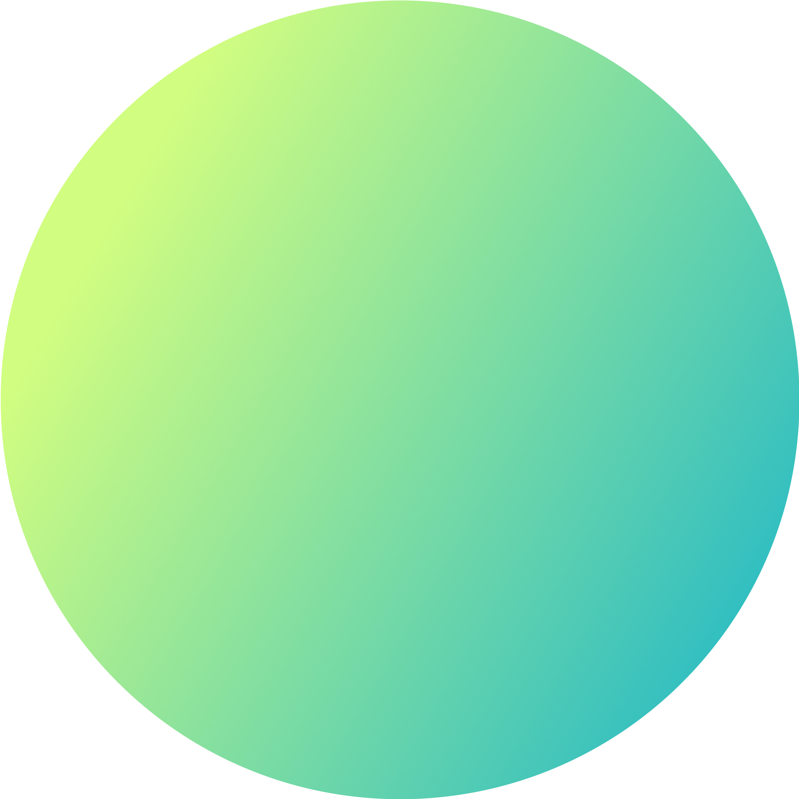

# Village Landing Page Enhancement Session Summary

## Project Overview
- **Project**: Village Landing Page Enhancement
- **Repository**: https://github.com/DhruvKapadia00/Village-Eng-Landing-Page
- **Key Commit**: 5642ede466554172af70dcbb06ff0d581c77aa87 (Enhanced landing page with interactive demo features and popup redirect)

## Changes Implemented

### 1. Demo Size and Layout Adjustments
- **Reduced Demo Size**: 
  - Applied `transform: scale(0.8)` to make the demo container smaller
  - Reduced height from 650px to 500px
  - Set `transform-origin: top center` to ensure proper scaling
  
- **Spacing Optimization**:
  - Reduced content padding from 40px to 20px
  - Decreased margins between elements throughout the demo
  - Optimized spacing to ensure the demo and buttons fit on screen without scrolling

- **Brain Icon Adjustments**:
  - Reduced size from 80px to 60px
  - Maintained PNG format for the logo (`village-brain-logo.png`)
  - Decreased margin below the icon from 20px to 10px

- **Section Padding**:
  - Reduced app-demo-section padding from 80px to 40px
  - Decreased section header margin from 40px to 20px

### 2. Suggestion Chips Improvements
- **Made More Compact**:
  - Decreased font size from 1rem to 0.9rem
  - Reduced padding from 10px/20px to 8px/16px
  - Shortened gap between chips from 10px to 8px
  - Made "Try asking about" text smaller with less margin

- **Content**:
  - Added Village Eng use cases as suggestion chips
  - Replaced "Merlin setup" with visual "PR review example"

### 3. Interactive Features
- **Popup Dialog**:
  - Added popup that appears when users enter custom queries
  - Prompts users to go to full demo or stay on current page
  - Updated redirect link to https://www.villagelabs.ai/get-started

## File Structure and Key Components

### Main Files
- **index.html**: Contains the main structure of the landing page
- **styles.css**: Contains all styling for the page, including the app demo
- **app-demo.js**: Handles the search functionality and interaction

### Key CSS Classes
```css
/* Main demo container */
.app-demo-container {
    width: 100%;
    max-width: 1000px;
    height: 500px;
    transform: scale(0.8);
    transform-origin: top center;
}

/* Demo content area */
.app-demo-content {
    padding: 20px;
}

/* Brain icon */
.brain-icon {
    width: 60px;
    height: 60px;
    margin-bottom: 10px;
}

/* Brain logo (PNG) */
.brain-logo {
    width: 100%;
    height: 100%;
    object-fit: contain;
}

/* Suggestion chips */
.suggestion-chip {
    padding: 8px 16px;
    font-size: 0.9rem;
}
```

### Key HTML Structure
```html
<section class="app-demo-section">
    <div class="container">
        <div class="section-header">
            <h2>Try Village for yourself</h2>
            <p>See how Village can help your team find information instantly</p>
        </div>
        <div class="app-demo-container">
            <!-- Demo header with dots -->
            <div class="app-demo-header">...</div>
            
            <!-- Demo content -->
            <div class="app-demo-content">
                <!-- Brain icon and title -->
                <div class="app-demo-brain">
                    <div class="brain-icon">
                        
                    </div>
                    <h3 class="demo-title">Your company's brain</h3>
                </div>
                
                <!-- Search bar -->
                <div class="app-demo-search">...</div>
                
                <!-- Search results area -->
                <div id="search-results" class="search-results">...</div>
            </div>
        </div>
        
        <!-- Suggestion chips -->
        <div class="demo-suggestions">
            <p>Try asking about:</p>
            <div class="suggestion-chips">
                <!-- Various suggestion chips -->
            </div>
        </div>
    </div>
</section>
```

## Development Notes

### Server Setup
- The site is served locally using Python's HTTP server on port 8000:
  ```
  python -m http.server 8000
  ```

### Design Decisions
1. **CSS Scaling vs. Individual Adjustments**:
   - Used CSS transform scaling to maintain proportions across all elements
   - This approach preserves the original design while making it more compact

2. **Responsive Design**:
   - Maintained responsive breakpoints for different screen sizes
   - Added specific adjustments for mobile views

3. **Visual Representation**:
   - Emphasized showing rather than telling about Village's capabilities
   - Used the PR review example to visually demonstrate functionality

### Known Issues and Considerations
- When making further adjustments, be careful with the scaling as it affects all child elements
- The PNG logo needs to be maintained for proper display
- Ensure the demo fits on screen without scrolling at 100% browser zoom

## Next Steps
1. **Testing**: Verify the layout across different browsers and screen sizes
2. **User Feedback**: Collect feedback on the new compact layout
3. **Potential Enhancements**: Consider additional visual examples or interactive elements

## GitHub Information
- The project is hosted on GitHub at: https://github.com/DhruvKapadia00/Village-Eng-Landing-Page
- Previous changes included adding interactive demo features and popup redirect functionality
